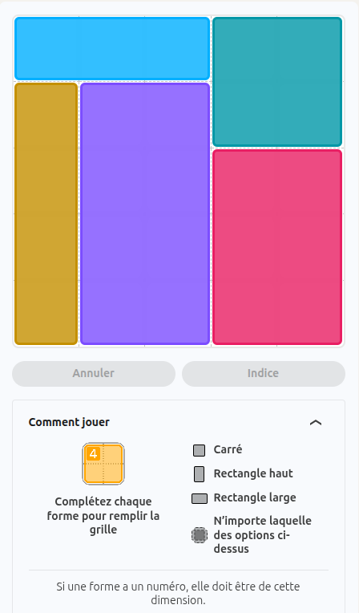
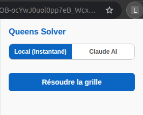
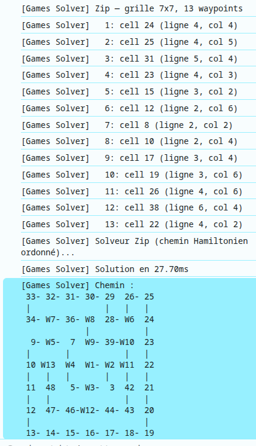
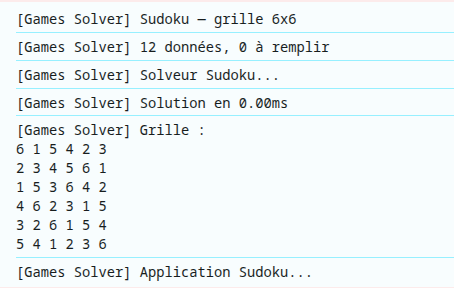
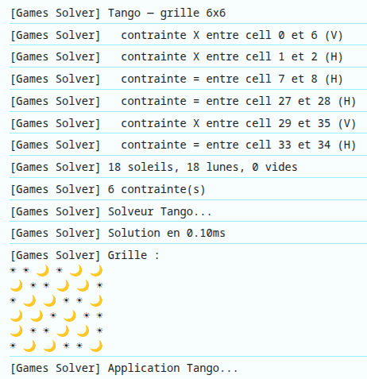
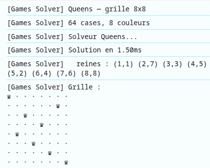

# LinkedIn Games Solver



Extension Chrome qui résout automatiquement les puzzles LinkedIn Games :
- [Queens](https://www.linkedin.com/games/queens/)
- [Zip](https://www.linkedin.com/games/zip/)
- [Tango](https://www.linkedin.com/games/tango/)
- [Sudoku](https://www.linkedin.com/games/sudoku/)
- [Patches](https://www.linkedin.com/games/patches/)

## Fonctionnement



Deux modes au choix :

| Mode | Vitesse | Coût | Fiabilité |
|---|---|---|---|
| **Local** | Instantané (<50ms) | Gratuit | 100% exact (backtracking) |
| **Claude AI** | ~2-3s | Clé API requise | Dépend du modèle |

### Mode Local

Solveur intégré directement dans l'extension, sans appel réseau ni clé API :

- **Queens** — backtracking CSP (contraintes de ligne, colonne, région, adjacence)
- **Zip** — chemin hamiltonien ordonné passant par tous les waypoints dans l'ordre
- **Tango** — backtracking CSP avec contraintes d'égalité/opposition
- **Sudoku** — backtracking classique
- **Patches** — backtracking CSP partitionnant la grille en rectangles colorés, avec log visuel des régions nommées

### Mode Claude AI

Envoie la grille à l'API Anthropic (`claude-opus-4-6`) et en reçoit la solution. Nécessite une clé API Anthropic.

## Installation


1. Cloner ou télécharger ce dossier
2. Ouvrir Chrome → `chrome://extensions/`
3. Activer le **mode développeur** (toggle en haut à droite)
4. Cliquer **"Charger l'extension non empaquetée"**
5. Sélectionner le dossier `queens-extension/`

## Utilisation

1. Aller sur l'un des jeux LinkedIn Games
2. Attendre que la grille soit chargée
3. Cliquer sur l'icône de l'extension dans la barre Chrome
4. Choisir le mode : **Local** ou **Claude AI**
5. Si Claude AI : entrer la clé API Anthropic (`sk-ant-api03-...`)
6. Cliquer **"Résoudre la grille"**

La clé API est sauvegardée localement dans le navigateur (jamais transmise ailleurs qu'à l'API Anthropic). Le mode sélectionné est également mémorisé.

## Logs (console du navigateur)

Les logs préfixés `[Games Solver]` détaillent chaque étape. Pour Zip, le chemin complet est affiché sous forme visuelle :

**Exemple pour Zip** : les cases sont numérotées selon l'ordre de passage, avec les waypoints `W1`, `W2`, etc. Les connexions entre cases sont indiquées par des traits horizontaux (`-`) et verticaux (`|`).



**Exemple pour SUDOKU** : les chiffres sont affichés dans une grille 9×9.



**Exemple pour Tango** : les symboles `=` et `x` sont affichés dans une grille, avec les contraintes d'équilibre indiquées.



**Exemple pour Queens** : les cases avec une reine sont marquées `Q`, les cases vides sont `.`. Les régions de couleur sont indiquées par des lettres (`A`, `B`, `C`, etc.) et les connexions entre cases par des traits.



- Les nombres indiquent l'ordre de passage (étape 1 à N)
- Les waypoints obligatoires sont préfixés `W` (`W1`, `W2`, ...)
- `-` = connexion horizontale entre deux cases consécutives
- `|` = connexion verticale entre deux cases consécutives

Pour Patches, la solution est affichée sous forme de grille colorée :

```
[Games Solver] Régions :
bleu  bleu  bleu  cyan  cyan
or    mauve mauve cyan  cyan
or    mauve mauve rose  rose
or    mauve mauve rose  rose
or    mauve mauve rose  rose
```

Les colonnes sont alignées automatiquement selon le nom le plus long. Pour les couleurs non reconnues, le fallback est `R1`, `R2`, etc.

## Structure

```
queens-extension/
├── manifest.json     # Configuration Chrome (Manifest V3)
├── content.js        # Lecture des grilles, solveurs locaux, application des solutions
├── background.js     # Appel à l'API Claude (mode Claude AI uniquement)
├── popup.html        # Interface utilisateur
└── popup.js          # Logique du popup, choix du mode
```

## Règles des puzzles

### Queens
- Une reine par ligne, par colonne et par région de couleur
- Aucune reine adjacente à une autre (y compris en diagonale)
- Grille de taille variable (détectée automatiquement via variable CSS)

### Zip
- Relier tous les waypoints numérotés dans l'ordre (1 → 2 → ... → N)
- Le chemin doit passer par toutes les cases de la grille (chemin hamiltonien)

### Tango
- Placer des symboles selon des contraintes d'égalité (`=`) et d'opposition (`x`)
- Équilibre imposé par ligne et par colonne

### Sudoku
- Chiffres 1–9 uniques par ligne, colonne et bloc 3×3

### Patches
- Partitionner la grille en rectangles, un par ancre colorée
- Chaque rectangle doit contenir exactement son ancre et respecter la taille (`n` cases) et la forme imposée : `HORIZONTAL_RECT` (largeur > hauteur), `VERTICAL_RECT` (hauteur > largeur), ou `UNKNOWN` (toute forme)

## Compatibilité

- Interface LinkedIn en français et en anglais
- Détection automatique du jeu actif selon l'URL
- Patches : couleurs nommées dans les logs (`bleu`, `cyan`, `mauve`, `or`, `rose`…) avec alignement automatique des colonnes
